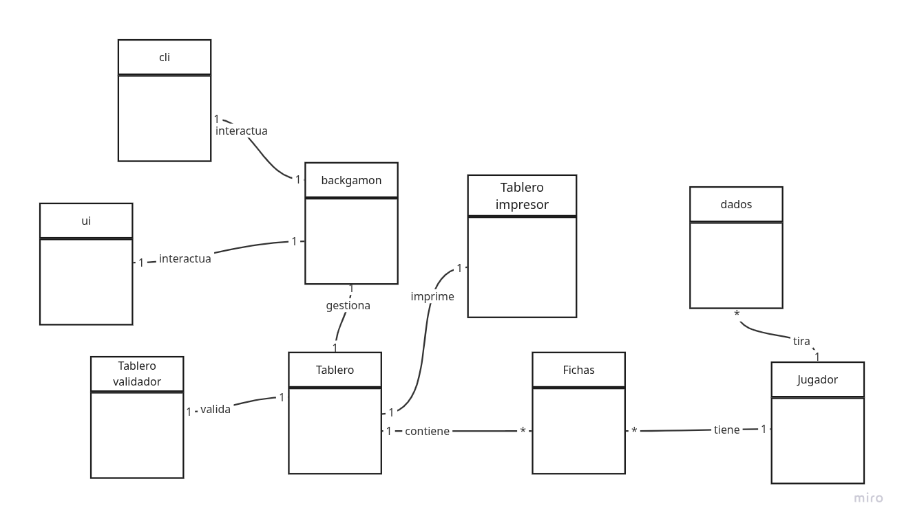

# 📋 Documento de Diseño del Sistema

## 🏗️ Resumen del Diseño General

El proyecto es una implementación del juego de backgammon en Python, estructurado en varias clases que representan los componentes principales del juego. El diseño sigue principios de programación orientada a objetos, definiendo clases como `Backgammon`, `Tablero`, `Ficha`, `Jugador`, y `Dado`, entre otras. Cada clase tiene responsabilidades claras.
## 🎯 Justificación de las Clases Elegidas

Decidi dejar la responabilidad de la verificacion de moviemientos en la clase de tableroValidador para separar 
las responsabilidades
Descidi seaparar la responsabilidad de imprmir el tablero en otra clase con un metodo estatico para asi no mezclar
la logica del juego con la interfaz de usuario
### Responsabilidades y Propósito
Backgammon -> maneja la logica del juego, gestiona turnos, y movimientos
Tablero -> el tablero realizara los movimientos de la ficha dentro de el
TableroValidador -> metodos para determinar si un movimiento es valido o no
cli -> interfaz de usuario
Ficha -> representa una ficha del juego
Jugador -> representa a un jugador del juego
Dado -> genera los numeros aleatorios para los movimientos siguiendo las reglas del backgammon
Tablero_impresor -> imprime el tablero, dado un arreglo de arreglos de fichas
## 📊 Justificación de Atributos
Decidi que el jugador no iba tener fichas en su clase, ya que las fichas estan en el tablero, y puedo identificarlas con el tipo, de hecho el jugador solo tiene el nombre y el tipo de ficha
### Selección y Diseño de Atributos

## 🔧 Decisiones de Diseño Relevantes
Decidi no usar una imagen para el tablero para asi tener mas control sobre los triangulos dibujados, y la estetica del tablero en general, ademas de que es mas liviano no tener
### Patrones y Arquitectura Implementada
Patron de diseño Facade para la interfaz de usuario, ya que la clase CLI y ui son las unicas que interactua con el usuario, y las demas clases no saben nada de la interfaz de usuario, y podria funcionar perfectamente con otro tipo de interfaz

## ⚠️ Excepciones y Manejo de Errores

### Excepciones Personalizadas Definidas

El sistema implementa un conjunto de excepciones personalizadas para manejar casos específicos del juego de backgammon

#### 🎯 **CasillaOcupadaException**
- **Propósito**: Se lanza cuando se intenta mover una ficha a un triángulo ocupado por 2 o más fichas del oponente
- **Contexto**: Validación de movimientos bloqueados por el rival

#### 🎯 **MovimientoNoJustoParaGanar**
- **Propósito**: Se lanza cuando se intenta sacar una ficha del tablero sin que sea un movimiento exacto para ganar, pero solo si se pasa del tablero
- **Contexto**: Validación de movimientos cuando esta por sacar una ficha

#### 🎯 **NingunMovimientoPosible**
- **Propósito**: Se lanza cuando el jugador no tiene movimientos válidos disponibles con los dados actuales
- **Contexto**: Determinación automática de paso de turno

#### 🎯 **NoHayFichaEnTriangulo**
- **Propósito**: Se lanza cuando se intenta seleccionar una ficha desde un triángulo que no contiene fichas del jugador actual
- **Contexto**: Validación de selección de fichas durante el movimiento

#### 🎯 **SeleccionDadoInvalida**
- **Propósito**: Se lanza cuando el jugador selecciona un índice de dado inválido (fuera de rango)
- **Contexto**: Validación de entrada del usuario en la CLI

#### 🎯 **SeleccionTrianguloInvalida**
- **Propósito**: Se lanza cuando el jugador selecciona un triángulo fuera del rango válido (0-23) (fuera de rango)
- **Contexto**: Validación de entrada del usuario para posiciones del tablero

## 🧪 Estrategias de Testing y Cobertura
En clases como tablero_validador, backgammon y ficha, se testean todas las funciones basadas en escenarios posibles.
En clases como CLI se testea las llamadas correctas a las funciones de otras clases, pero no se teste que esas funciones hagan lo que deben hacer, ya que eso se testea en las clases correspondientes.
### Plan de Pruebas y Cobertura de Código

## 🏛️ Principios SOLID

### Cumplimiento de los Principios SOLID

#### 🔸 Single Responsibility Principle (SRP)
Separo la responsabilidad de validar movimientos en una clase aparte, y la responsabilidad de imprimir el tablero en otra clase aparte, y la responsabilidad de manejar la logica del juego en otra clase aparte

#### 🔸 Open/Closed Principle (OCP)
Las interfaces usan interfaces como IJuegoInterfazMovimientos, IJuegoInterfazDados, IJuegoInterfazDadosValidaciones permitiendo asi la extension del codigo sin modificar las clases existentes

#### 🔸 Liskov Substitution Principle (LSP)
No uso herencia

#### 🔸 Interface Segregation Principle (ISP)
Hay interfaces separadas como JuegoInterfazDados y JuegoInterfazDadosValidaciones, ya que si ambas interfaces estuvieran juntas, las interfaces que no necesiten validar el dado (como la ui) tendrian que implementar un metodo que no usan
#### 🔸 Dependency Inversion Principle (DIP)
Todas las clases dependen de abstracciones, y son pasadas en el constructor, no se instancian en el constructor como estaba antes

## 📎 Anexos

### 📈 Diagramas UML

#### Diagrama de Clases
