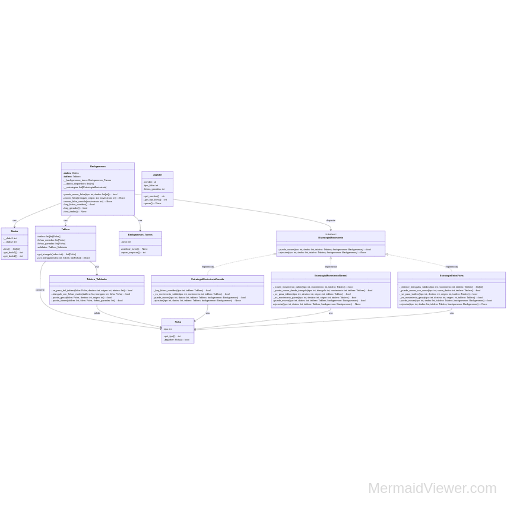

# 📋 Documento de Diseño del Sistema

## 🏗️ Resumen del Diseño General

El proyecto es una implementación del juego de backgammon en Python, estructurado en varias clases que representan los componentes principales del juego. El diseño sigue principios de programación orientada a objetos, definiendo clases como `Backgammon`, `Tablero`, `Ficha`, `Jugador`, y `Dado`, entre otras. Cada clase tiene responsabilidades claras.
## 🎯 Justificación de las Clases Elegidas

### Responsabilidades y Propósito
Backgammon -> maneja la logica del juego
Tablero -> el tablero realizara los movimientos de la ficha dentro de el
TableroValidador -> metodos para determinar si un movimiento es valido o no
cli -> interfaz de usuario
Ficha -> representa una ficha del juego
Jugador -> representa a un jugador del juego
Dado -> genera los numeros aleatorios para los movimientos siguiendo las reglas del backgammon
Tablero_impresor -> imprime el tablero, dado un arreglo de arreglos de fichas
Backgammon_Turnos -> maneja los turnos de los jugadores
Tablero_UI -> maneja la interfaz grafica del tablero
UI -> maneja la interfaz grafica del juego
Cartel_UI -> maneja los carteles de error y victoria en la interfaz grafica (esta hecho para ser reutilizable )
Campos_UI -> maneja los campos de la interfaz grafica para realizar los movimientos
Estrategia_movimiento_unico -> estrategia para mover una ficha con el dado mayor cuando no puede mover con la suma
Estrategia_movimiento_normal -> Valida que se pueda mover normalmente
Estrategia_movimiento_comidas -> Valida que se pueda mover las fichas comidas que vuelven a entrar al tablero
## 📊 Justificación de Atributos
Decidi que el jugador no iba tener fichas en su clase, ya que las fichas estan en el tablero, y puedo identificarlas con el tipo, de hecho el jugador solo tiene el nombre y el tipo de ficha
Decidi que no hacia falta tener un bool en la clase ficha para saber si esta comida o no, ya que si una ficha esta comida, no estara en el array de fichas_comidas
### Selección y Diseño de Atributos 

## 🔧 Decisiones de Diseño Relevantes
Decidi no usar una imagen para el tablero para asi tener mas control sobre los triangulos dibujados, y la estetica del tablero en general, ademas de que es mas liviano no tener
Decidi dejar la responabilidad de la verificacion de moviemientos en la clase de tableroValidador para separar 
las responsabilidades
Decidi seaparar la responsabilidad de imprmir el tablero en otra clase con un metodo estatico para asi no mezclar
la logica del juego con la interfaz de usuario
Decidi separar los turnos en otra clase para que la clase backgammon no tenga tantas responsabilidades
Decidi "componentizar" la interfaz grafica en varias clases para separar responsabilidades y hacer el codigo mas mantenible, como 
en Campos_UI, Cartel_UI, Tablero_UI y todas ellas son manejadas por Backgammon_UI que controla cuando se muestran y ocultan
Hice que la clase UI reciba una instancia de ICartelUI en su constructor, para implementar el principio de inversion de dependencias (DIP), permitiendo asi cambiar la implementacion de cartel UI
Implemente el patron de estrategia para manejar los diferentes tipos de movimientos que se pueden hacer en el backgammon, como movimientos normales, movimientos de fichas comidas y movimientos unicos cuando no se puede mover con la suma de los dados, permitiendo asi extender las validaciones facilmente sin modificar la clase backgammon al validar si puede mover o no, ademas al todas implementar la interfaz IEstrategiaMovimiento, Implementeo el principio DIP en backgammon, ya que depende de la abstraccion IEstrategiaMovimiento y no de una implementacion concreta, permitiendo asi agregar nuevas estrategias de movimiento sin modificar la clase backgammon (se le pasa un arreglo de estrategias en el constructor)

### Patrones y Arquitectura Implementada
Patron de diseño Facade para la interfaz de usuario, ya que la clase CLI y ui son las unicas que interactua con el usuario, y las demas clases no saben nada de la interfaz de usuario, y podria funcionar perfectamente con otro tipo de interfaz, ademas de ser consistente.
Patron de estrategia para manejar las diferentes validaciones que se pueden hacer en el backgammon, como movimientos normales, movimientos de fichas comidas y movimientos unicos cuando no se puede mover con la suma de los dados, permitiendo asi extender las validaciones facilmente sin modificar la clase backgammon al validar si puede mover o no

## ⚠️ Excepciones y Manejo de Errores

### Excepciones Personalizadas Definidas

El sistema implementa un conjunto de excepciones personalizadas para manejar casos específicos del juego de backgammon

#### 🎯 **CasillaOcupadaException**
- **Propósito**: Se lanza cuando se intenta mover una ficha a un triángulo ocupado por 2 o más fichas del oponente
- **Contexto**: Validación de movimientos bloqueados por el rival

#### 🎯 **MovimientoNoJustoParaGanar**
- **Propósito**: Se lanza cuando se intenta sacar una ficha del tablero sin que sea un movimiento exacto para ganar, pero solo si se pasa del tablero
- **Contexto**: Validación de movimientos cuando esta por sacar una ficha

#### 🎯 **NingunMovimientoPosible**
- **Propósito**: Se lanza cuando el jugador no tiene movimientos válidos disponibles con los dados actuales
- **Contexto**: Determinación automática de paso de turno

#### 🎯 **NoHayFichaEnTriangulo**
- **Propósito**: Se lanza cuando se intenta seleccionar una ficha desde un triángulo que no contiene fichas del jugador actual
- **Contexto**: Validación de selección de fichas durante el movimiento

#### 🎯 **SeleccionDadoInvalida**
- **Propósito**: Se lanza cuando el jugador selecciona un índice de dado inválido (fuera de rango)
- **Contexto**: Validación de entrada del usuario en la CLI

#### 🎯 **SeleccionTrianguloInvalida**
- **Propósito**: Se lanza cuando el jugador selecciona un triángulo fuera del rango válido (0-23) (fuera de rango)
- **Contexto**: Validación de entrada del usuario para posiciones del tablero
#### 🎯 **NoPuedeLiberar**
- **Propósito**: Se lanza cuando un jugador intenta liberar fichas antes de sacar todas del home
- **Contexto**: Validación de movimientos de liberación de fichas

## 🧪 Estrategias de Testing y Cobertura
En clases como tablero_validador, backgammon y ficha, se testean todas las funciones basadas en escenarios posibles.
En clases como CLI se testea las llamadas correctas a las funciones de otras clases, pero no se teste que esas funciones hagan lo que deben hacer, ya que eso se testea en las clases correspondientes.
En metodos claves como puede_hacer_movimiento se testean muchos escenarios posibles para asegurar que la logica del juego no falle, inclusive testeando escenarios dificiles de replicar en un juego real. 
### Plan de Pruebas y Cobertura de Código
actualmente la cobertura es del 91% en toda la aplicacion, haciendo enfasis el core donde la cobertura es de casi 100%, hay metodos que se testean mas que otros, como el puede_hacer_movimiento en backgammon, que tiene muchos escenarios posibles, y es un metodo clave en la logica del juego que no puede fallar. Ademas de testear cada estrategia con sus debidos escenarios.

## 🏛️ Principios SOLID

### Cumplimiento de los Principios SOLID

#### 🔸 Single Responsibility Principle (SRP)
Separo la responsabilidad de validar movimientos en una clase aparte, y la responsabilidad de imprimir el tablero en otra clase aparte, y la responsabilidad de manejar la logica del juego en otra clase aparte

#### 🔸 Open/Closed Principle (OCP)
Las interfaces usan interfaces como IJuegoInterfazMovimientos, IJuegoInterfazDados, IJuegoInterfazDadosValidaciones permitiendo asi la extension del codigo sin modificar las clases existentes
Backgammon usa el patron de estrategia para manejar las diferentes validaciones sobre los movimientos que se pueden hacer en el backgammon, como movimientos normales, movimientos de fichas comidas y movimientos unicos cuando no se puede mover con la suma de los dados, permitiendo asi extender las validaciones facilmente sin modificar la clase backgammon al validar si puede mover o no

#### 🔸 Liskov Substitution Principle (LSP)
No uso herencia

#### 🔸 Interface Segregation Principle (ISP)
Hay interfaces separadas como JuegoInterfazDados y JuegoInterfazDadosValidaciones, ya que si ambas interfaces estuvieran juntas, las interfaces que no necesiten validar el dado (como la ui) tendrian que implementar un metodo que no usan
#### 🔸 Dependency Inversion Principle (DIP)
La clase UI recibe una instancia de ICartelUI en su constructor, permitiendo asi que la clase UI no dependa de una implementacion concreta de cartel UI, sino de una abstraccion, permitiendo asi cambiar la implementacion de cartel y reutilizar codigo
La clase Backgammon depende de la abstraccion IEstrategiaMovimiento y no de una implementacion concreta, permitiendo asi agregar nuevas estrategias de movimiento sin modificar la clase backgammon (se le pasa un arreglo de estrategias en el constructor)
## 📎 Anexos

### 📈 Diagramas UML
#### Diagrama de Clases

