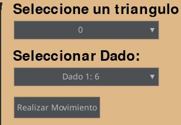
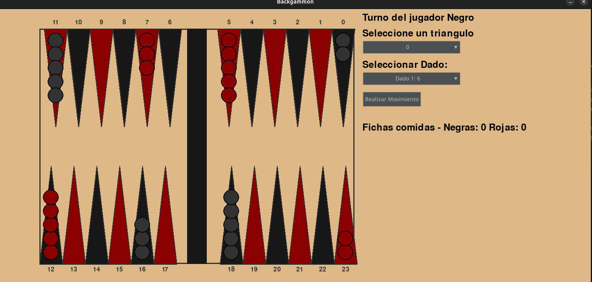

# Backgammon

**Autor:** Mateo Kristich

## Descripción
Implementación del clásico juego de Backgammon en Python con interfaz de línea de comandos (CLI) y UI. El juego sigue las reglas tradicionales del backgammon e incluye todas las mecánicas principales como fichas comidas, movimientos bloqueados y condiciones de victoria.

## Cómo Ejecutar el Juego (CLI)

### Requisitos
- Python 3.8 o superior
- Las dependencias del proyecto (ver `requirements.txt` si existe)

### Ejecutar desde la línea de comandos
```bash
# Navegar al directorio del proyecto
cd /ruta/al/proyecto/computacion-2025-backgammon-MateK12

# Ejecutar el juego
python -m src/cli/cli
```

### Ejecutar con módulo
```bash
# Desde el directorio raíz del proyecto
python -m src.cli.cli
```

## Cómo Jugar
### Inicio del Juego
1. Al ejecutar, el juego te pedirá los nombres de los jugadores:
   - **Jugador Rojo**: Primer jugador
   - **Jugador Negro**: Segundo jugador

2. El sistema determinará automáticamente quién comienza mediante una tirada de dados inicial.

### Mecánicas del Juego

#### Turnos
- Cada jugador tira dos dados en su turno
- Si salen **dobles** (dos números iguales), el jugador puede usar ese número **4 veces**
- El jugador debe usar todos los dados disponibles si es posible

#### Selección de Dados
```
Dados disponibles: [3, 5]
Selecciona el dado usando [0, 1]
> 0  # Selecciona el primer dado (valor 3)
```

#### Movimiento de Fichas

##### Fichas Normales
```
Selecciona el triángulo de origen (0-23): 
> 12  # Selecciona el triángulo 12 como origen
```

##### Fichas Comidas
- Si tienes fichas comidas, **debes** ingresarlas al tablero antes de mover otras fichas
- Solo necesitas seleccionar el dado, el sistema las coloca automáticamente

#### Objetivo del Juego
- **Fichas Rojas**: Mueven desde el triángulo 23 hacia el 0, luego salen del tablero
- **Fichas Negras**: Mueven desde el triángulo 0 hacia el 23, luego salen del tablero
- **Victoria**: El primer jugador en sacar todas sus fichas del tablero gana

### Reglas Importantes

#### Movimientos Bloqueados
- No puedes mover a un triángulo ocupado por **2 o más fichas del oponente**
- Puedes mover a triángulos con **1 ficha rival** (la "comes")

#### Fichas Comidas
- Si una ficha aterriza en un triángulo con **1 ficha rival**, la ficha rival es "comida"
- Las fichas comidas deben reingresar al tablero antes de hacer otros movimientos

#### Sacar Fichas del Tablero
- Solo puedes sacar fichas cuando **todas** tus fichas están en tu zona de casa:
  - **Rojas**: Triángulos 0-5
  - **Negras**: Triángulos 18-23

#### Sin Movimientos Posibles
- Si no puedes hacer ningún movimiento con los dados disponibles, tu turno termina automáticamente

### Interfaz del Juego

#### Tablero
```
================================================================================
Puntos 12-7:  12   11   10    9    8    7  |   6    5    4    3    2    1
             [●]  [ ]  [ ]  [●]  [ ]  [ ]  | [●]  [ ]  [●]  [ ]  [ ]  [ ]
             [●]  [ ]  [ ]  [●]  [ ]  [ ]  | [●]  [ ]  [●]  [ ]  [ ]  [ ]
--------------------------------------------------------------------------------
             [●]  [ ]  [ ]  [●]  [ ]  [ ]  | [●]  [ ]  [●]  [ ]  [ ]  [ ]
             [●]  [ ]  [ ]  [●]  [ ]  [ ]  | [●]  [ ]  [●]  [ ]  [ ]  [ ]
Puntos 13-18:  13   14   15   16   17   18  |  19   20   21   22   23   24
================================================================================
```

#### Mensajes del Sistema
- **Dados tirados**: `[3, 5]`
- **Dobles**: `¡Doble!` (cuando salen números iguales)
- **Errores**: Aparecen en rojo cuando hay movimientos inválidos
- **Turno actual**: Indica qué jugador debe mover

### Ejemplos de Juego

#### Movimiento Normal
```
Turno del jugador rojo: Juan
Dados tirados: [4, 2]
Dados disponibles: [4, 2]
Selecciona el dado usando [0, 1]
> 0
Selecciona el triángulo de origen (0-23): 
> 23
```

#### Fichas Comidas
```
Turno del jugador negro: María
Dados tirados: [3, 6]
Dados disponibles: [3, 6]
Selecciona el dado usando [0, 1]
> 1
# La ficha comida se coloca automáticamente
```

#### Dobles
```
Turno del jugador rojo: Juan
Dados tirados: [5, 5, 5, 5]
¡Doble!
Dados disponibles: [5, 5, 5, 5]
# Puedes usar el 5 cuatro veces
```


## Cómo Ejecutar el Juego (UI)

### Requisitos
- Python 3.8 o superior
- Las dependencias del proyecto (ver `requirements.txt` si existe)

### Ejecutar desde la línea de comandos
```bash
# Navegar al directorio del proyecto
cd /ruta/al/proyecto/computacion-2025-backgammon-MateK12

# Ejecutar el juego
python -m src.pygame_ui.ui
```

## Cómo Jugar
### Inicio del Juego

2. El sistema determinará automáticamente quién comienza mediante una tirada de dados inicial.

### Mecánicas del Juego


#### Selección de Dados
Seleccione un dado usando el select

#### Movimiento de Fichas

##### Fichas Normales
```
Selecciona el triángulo de origen usando el select 
```

Una vez seleccionado el triángulo de origen y el dado, presione el boton mover ficha para mover la ficha
##### Fichas Comidas
- Si tienes fichas comidas, **debes** ingresarlas al tablero antes de mover otras fichas
- Solo necesitas seleccionar el dado, y presionar el boton mover ficha

### Interfaz del Juego

#### Tablero


